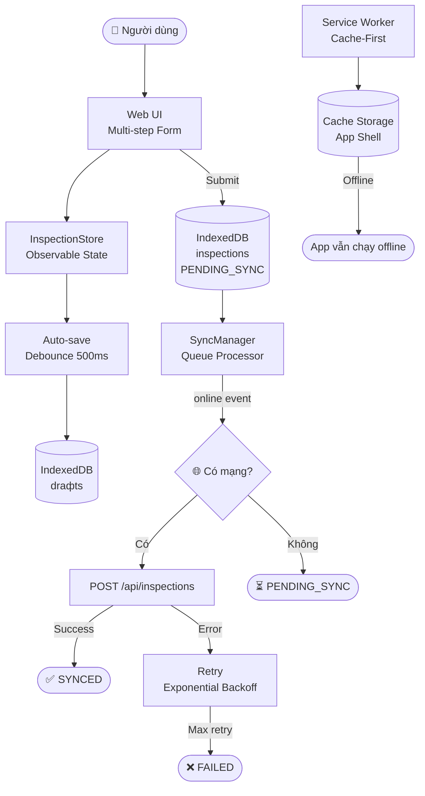

# VKU Facility Inspector

Hệ thống khảo sát cơ sở vật chất **Đại học Công nghệ Thông tin và Truyền thông Việt–Hàn (VKU)** theo mô hình **Offline-First PWA**.

---

## Giới thiệu

**VKU Facility Inspector** cho phép cán bộ/sinh viên khảo sát tình trạng cơ sở vật chất (phần cứng, máy chiếu, điều hòa, điện, nội thất) ngay cả khi **không có kết nối mạng**. Dữ liệu được lưu trữ trên thiết bị (IndexedDB) và tự động đồng bộ lên server khi mạng trở lại.

---

## Công nghệ

| Thành phần | Công nghệ |
|---|---|
| Frontend | Vite + TypeScript strict |
| Giao diện | Vanilla HTML/CSS (không framework) |
| Offline Storage | IndexedDB (`idb`) |
| PWA | Service Worker (Cache-First) |
| Mock Backend | Node.js + Express |
| Fonts | Google Fonts (Inter) |

---

## Cấu trúc project

```
vku-facility-inspector/
├── public/
│   ├── icons/          # PWA icons (192, 512)
│   ├── manifest.json   # PWA manifest
│   └── sw.js           # Service Worker
│
├── src/
│   ├── components/
│   │   ├── Header.ts       # Header + network badge
│   │   ├── SyncStatus.ts   # Panel trạng thái đồng bộ
│   │   └── StepIndicator.ts # Progress bar form
│   │
│   ├── views/
│   │   ├── FormView.ts    # Multi-step form (6 bước)
│   │   ├── HistoryView.ts # Lịch sử khảo sát
│   │   └── toast.ts       # Thông báo toast
│   │
│   ├── services/
│   │   ├── db/
│   │   │   ├── database.ts             # IndexedDB init (idb)
│   │   │   └── inspectionRepository.ts # CRUD operations
│   │   ├── sync/
│   │   │   └── syncManager.ts  # Sync queue + retry
│   │   └── api/
│   │       └── apiService.ts   # REST API client
│   │
│   ├── store/
│   │   └── inspectionStore.ts  # Observable form state
│   │
│   ├── types/
│   │   ├── inspection.ts  # Core interfaces
│   │   └── css.d.ts       # Type declarations
│   │
│   ├── styles/
│   │   └── main.css       # Design system (CSS variables)
│   │
│   ├── app.ts    # App orchestrator + routing
│   └── main.ts   # Entry point + SW registration
│
├── mock-server/
│   ├── server.cjs   # Express API server
│   └── package.json
│
├── .env.example
├── index.html
├── vite.config.ts
└── tsconfig.json
```

---

## Cài đặt

```bash
# Clone hoặc cd vào thư mục dự án
cd vku-facility-inspector

# Cài dependencies cho frontend
npm install

# Copy env file
cp .env.example .env
```

---

## Chạy project (Development)

```bash
npm run dev
```

Mở trình duyệt tại: **http://localhost:5173**

---

## Chạy Mock Server

Mở **terminal mới** (giữ nguyên dev server):

```bash
# Từ thư mục vku-facility-inspector
npm run server

# Hoặc chạy thủ công
cd mock-server
npm install
node server.cjs
```

Mock server chạy tại: **http://localhost:3000**

**Endpoints:**
```
POST   /api/inspections         # Nhận khảo sát
GET    /api/inspections         # Xem danh sách đã nhận
POST   /api/debug/toggle-fail   # Bật/tắt giả lỗi (test retry)
GET    /api/health              # Kiểm tra server
```

---

## Build Production

```bash
npm run build
```

Output: thư mục `dist/`

```bash
# Preview production build
npm run preview
```

---

## Deploy

### Vercel

```bash
npm install -g vercel
vercel
```

Hoặc kết nối GitHub repo tại [vercel.com](https://vercel.com).

### Cloudflare Pages

1. Đăng nhập [pages.cloudflare.com](https://pages.cloudflare.com)
2. **Connect to Git** → chọn repo
3. Build settings:
   - **Build command**: `npm run build`
   - **Output directory**: `dist`
4. Add environment variable: `VITE_API_URL=https://your-api.com/api`

---

## Kiến trúc Offline-First



---

## Hướng dẫn kiểm thử

### Test Online Flow
1. Đảm bảo mock server đang chạy (`npm run server`)
2. Điền form → Submit
3. Console mock server hiển thị: `✅ Nhận inspection: ...`
4. History → badge "Đã đồng bộ"

### Test Offline Flow
1. DevTools → Network → **Offline**
2. Điền form → Submit
3. Badge: "⏳ Chờ đồng bộ"
4. Bật lại mạng → tự động sync

### Test Draft Restore
1. Điền một vài bước trong form
2. Refresh trang (F5)
3. Popup hỏi "Tiếp tục từ lần trước?" → chọn **Tiếp tục**
4. Dữ liệu được khôi phục

### Test Retry
1. Gọi `POST /api/debug/toggle-fail` (bật giả lỗi)
2. Submit → quan sát retry 3 lần → FAILED
3. Gọi lại endpoint để tắt giả lỗi
